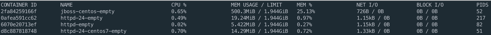

Servers
================================================================================

Apache Web Server
--------------------------------------------------------------------------------

### [centos/httpd-24-centos7](https://hub.docker.com/r/centos/httpd-24-centos7/)
Apache HTTP Server 2.4 Container Image

`docker pull centos/httpd-24-centos7`


```bash
docker build -f apache/centos/Dockerfile -t httpd-24-centos7-empty-image .
docker run -dit --name httpd-24-centos7-empty -p 8081:80 httpd-24-centos7-empty-image
```

## [httpd](https://hub.docker.com/_/httpd)
Apache Server

`docker pull httpd`


```bash
docker build -f apache/httpd/Dockerfile -t httpd-empty-image .
docker run -dit --name httpd-empty -p 8082:80 httpd-empty-image
```

### [rhel8/httpd-24](https://catalog.redhat.com/software/containers/detail/5ba0addbbed8bd6ee819856a?container-tabs=overview&gti-tabs=red-hat-login)
Apache httpd 2.4

`docker pull registry.redhat.io/rhel8/httpd-24`


```bash
docker run -dit --name httpd-24-empty -p 8083:80 registry.redhat.io/rhel8/httpd-24
```
### Configuration
To pass configuration:

```dockerfile
COPY ./my-httpd.conf /usr/local/apache2/conf/httpd.conf
```


JBoss EAP
--------------------------------------------------------------------------------

### centos/jdk8/jboss
centos base, add jdk8 and JBoss
```bash
docker build -f jboss/centos/Dockerfile -t jboss-centos-empty-image .
docker run -dit --name jboss-centos-empty -p 8084:80 jboss-centos-empty-image
```

Compare empty Dockers
--------------------------------------------------------------------------------

